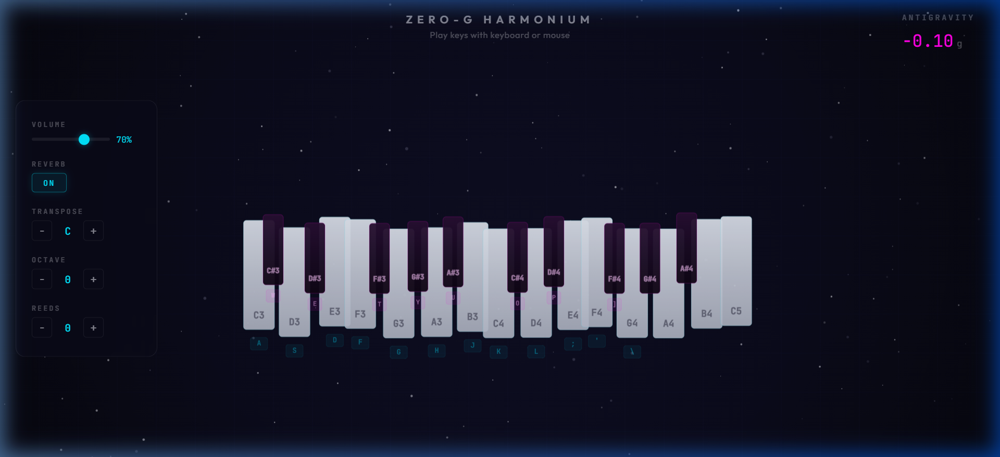
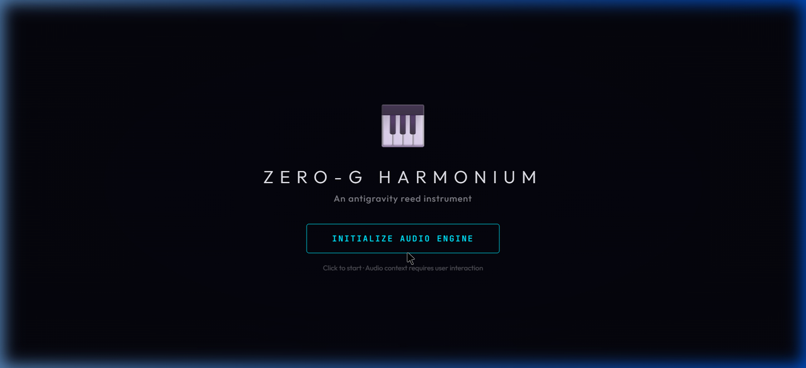

<div align="center">


# 🎹 Zero-G Harmonium

### An Antigravity Web-Based Indian/Western Harmonium

**Play a real harmonium right in your browser — with floating keys, physics simulation, and authentic reed synthesis.**

[](https://karmaboy1309.github.io/web_harmonium/)
[](https://github.com/karmaboy1309/web_harmonium)
[](LICENSE)

</div>

---

## 📸 Screenshots

### 🎵 Main Interface — Harmonium in Action

*Full two-octave keyboard (C3–C5) floating in an antigravity environment with cosmic starfield, settings panel, and keyboard labels*

### 🚀 Start Screen

*Click "Initialize Audio Engine" to begin — audio context requires user interaction*

---

## ✨ What is Zero-G Harmonium?

Zero-G Harmonium is a **fully playable, browser-based harmonium** that combines:

- 🎹 **Realistic Harmonium Sound** — Multi-layer oscillator synthesis (Sawtooth + Square + Triangle + Buzz) producing the characteristic buzzy, warm reed timbre of a real harmonium
- 🌌 **Antigravity Physics** — Every key is a floating body in a Matter.js zero-gravity world. Press a key → it dips down. Release → antigravity floats it back up.
- ✨ **Particle Effects** — Notes emit colored particles (pitch → color: warm golds for low notes, cool cyans for high) that float upward in the antigravity field
- 🎛️ **Full Control Panel** — Volume, Reverb, Transpose, Octave Shift, and Additional Reeds

No installation, no plugins — just open and play!

---

## 🎮 How to Play

### Step 1: Open the Harmonium
Open the app in your browser and click **"Initialize Audio Engine"** to start.

### Step 2: Play Notes
You can play the harmonium in two ways:

#### 🖱️ Mouse/Touch
Simply **click on any key** to play its note. Release to stop.

#### ⌨️ Computer Keyboard
Use your keyboard to play — each key on your keyboard maps to a harmonium key:

| Keyboard Key | Harmonium Note | Type |
|:---:|:---:|:---:|
| `A` | C3 (Sa) | Natural |
| `W` | C#3 | Sharp |
| `S` | D3 (Re) | Natural |
| `E` | D#3 | Sharp |
| `D` | E3 (Ga) | Natural |
| `F` | F3 (Ma) | Natural |
| `T` | F#3 | Sharp |
| `G` | G3 (Pa) | Natural |
| `Y` | G#3 | Sharp |
| `H` | A3 (Dha) | Natural |
| `U` | A#3 | Sharp |
| `J` | B3 (Ni) | Natural |
| `K` | C4 (Upper Sa) | Natural |
| `O` | C#4 | Sharp |
| `L` | D4 (Upper Re) | Natural |
| `P` | D#4 | Sharp |
| `;` | E4 (Upper Ga) | Natural |
| `'` | F4 (Upper Ma) | Natural |
| `]` | F#4 | Sharp |
| `\` | G4 (Upper Pa) | Natural |

> 💡 **Tip:** The keyboard binding for each key is also shown as a small badge **below each harmonium key** on the screen!

### Step 3: Adjust Settings
Use the **Settings Panel** on the left side:

| Setting | What it does |
|---------|-------------|
| **Volume** | Drag the slider to adjust master volume (0–100%) |
| **Reverb** | Toggle ON/OFF — adds room reverb effect for richer sound |
| **Transpose** | Shift all notes up/down by semitones. Shows current root note (C, C#, D, etc.) |
| **Octave** | Shift entire keyboard up/down by octaves (-2 to +2) |
| **Reeds** | Add 0–3 additional reed voices for a richer, fuller harmonium sound |

---

## 🛠️ Tech Stack

| Technology | Purpose |
|:---:|:---|
| [**Tone.js**](https://tonejs.github.io/) | Audio synthesis engine — oscillators, envelopes, effects chain |
| [**Matter.js**](https://brm.io/matter-js/) | 2D physics engine — antigravity world, floating key bodies, constraints |
| [**Vite**](https://vitejs.dev/) | Lightning-fast build tool & dev server |
| **Vanilla JS** | Zero frameworks — pure performance |
| **HTML5 Canvas** | Custom rendering — starfield, key glow effects, particles, vignette |

---

## 🚀 Getting Started — Clone & Run Locally

### Prerequisites
Make sure you have these installed:
- **Node.js** (v16 or higher) — [Download here](https://nodejs.org/)
- **Git** — [Download here](https://git-scm.com/)

### Step 1: Clone the Repository

```bash
git clone https://github.com/karmaboy1309/web_harmonium.git
```

### Step 2: Navigate to the Project

```bash
cd web_harmonium
```

### Step 3: Install Dependencies

```bash
npm install
```

This installs `tone` (audio) and `matter-js` (physics).

### Step 4: Start the Development Server

```bash
npm run dev
```

### Step 5: Open in Browser

Open your browser and go to:
```
http://localhost:5173
```

Click **"Initialize Audio Engine"** and start playing! 🎵

---

## 📁 Project Structure

```
web_harmonium/
│
├── index.html              # Main HTML — canvas, settings panel, start overlay
│
├── src/
│   ├── main.js             # 🎯 Orchestrator — game loop, input handling, settings wiring
│   ├── physics.js          # ⚙️ Matter.js antigravity world — floating key bodies & constraints
│   ├── audio.js            # 🔊 Tone.js harmonium synthesis — 4-layer oscillators, effects chain
│   ├── particles.js        # ✨ Particle resonance system — pitch-to-color mapping
│   ├── renderer.js         # 🎨 Canvas renderer — starfield, keys, glow effects, vignette
│   └── style.css           # 🎭 Dark cosmic theme — glassmorphism UI, settings panel
│
├── screenshots/            # UI screenshots for README
├── package.json            # Dependencies & scripts
├── .gitignore              # Git ignore rules
└── README.md               # This file
```

---

## 🏗️ Architecture Overview

```
┌─────────────────────────────────────────────────────────┐
│                    main.js (Orchestrator)                │
│                                                         │
│  Game Loop (60fps) ──► Physics ──► Audio ──► Particles  │
│       ▲                                                 │
│       │  Input: Keyboard / Mouse / Touch                │
└───────┼─────────────────────────────────────────────────┘
        │
        ▼
┌──────────────┐  ┌──────────────┐  ┌──────────────┐
│  physics.js  │  │   audio.js   │  │ particles.js │
│              │  │              │  │              │
│ Matter.js    │  │ Tone.js      │  │ Pitch→Color  │
│ Gravity:-0.1 │  │ 4-layer OSC  │  │ Antigravity  │
│ Key Bodies   │  │ Effects FX   │  │ Float-up     │
│ Constraints  │  │ Volume/Reverb│  │ Burst/Decay  │
└──────────────┘  └──────────────┘  └──────────────┘
        │                │                │
        └────────────────┼────────────────┘
                         ▼
               ┌──────────────────┐
               │   renderer.js    │
               │                  │
               │ Canvas Rendering │
               │ Starfield + Keys │
               │ Glow + Particles │
               │ Vignette         │
               └──────────────────┘
```

### Audio Signal Chain
```
Oscillators (Saw + Square + Triangle)
    │
    ▼
Amplitude Envelope (ADSR)
    │
    ▼
Per-Voice Low-pass Filter
    │
    ▼
Master Low-pass Filter
    │
    ▼
Compressor → Limiter
    │
    ├──► Dry Path ──────────────────► Master Gain ──► 🔊 Output
    │                                    ▲
    └──► Reverb ──► Wet Gain ────────────┘
```

---

## 🤝 Contributing

Contributions are welcome! Feel free to:

1. **Fork** this repository
2. **Create a branch** (`git checkout -b feature/my-feature`)
3. **Commit** your changes (`git commit -m "Add my feature"`)
4. **Push** to the branch (`git push origin feature/my-feature`)
5. Open a **Pull Request**

---

## 📄 License

This project is licensed under the **MIT License** — feel free to use, modify, and distribute.

---

<div align="center">

### Made with ❤️ and 🎵

**If you liked this project, give it a ⭐ on GitHub!**

[⭐ Star on GitHub](https://github.com/karmaboy1309/web_harmonium)

</div>
